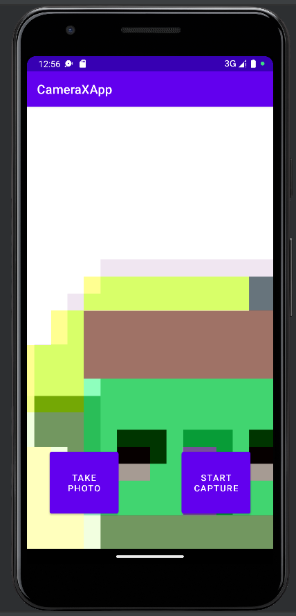

# Lab2
#### 2.2构建CameraX应用

###### 步骤

1、File -> New -> New Project -> Empty Activity -> 选择Kotlin -> 命名CameraXApp -> Finish

2、在build.gradle里添加gradle依赖

```
dependencies {
  def camerax_version = "1.1.0-beta01"
  implementation "androidx.camera:camera-core:${camerax_version}"
  implementation "androidx.camera:camera-camera2:${camerax_version}"
  implementation "androidx.camera:camera-lifecycle:${camerax_version}"
  implementation "androidx.camera:camera-video:${camerax_version}"

  implementation "androidx.camera:camera-view:${camerax_version}"
  implementation "androidx.camera:camera-extensions:${camerax_version}"
}
```

3、在 buildTypes 之后，添加以下代码

```
compileOptions {
    sourceCompatibility JavaVersion.VERSION_1_8
    targetCompatibility JavaVersion.VERSION_1_8
}
```

4、在 android{} 代码块末尾添加如下代码

```
buildFeatures {
   viewBinding true
}
```

5、打开res/layout/activity_main.xml 的 activity_main 布局文件，并将其替换为以下代码

```
<?xml version="1.0" encoding="utf-8"?>
<androidx.constraintlayout.widget.ConstraintLayout
   xmlns:android="http://schemas.android.com/apk/res/android"
   xmlns:app="http://schemas.android.com/apk/res-auto"
   xmlns:tools="http://schemas.android.com/tools"
   android:layout_width="match_parent"
   android:layout_height="match_parent"
   tools:context=".MainActivity">

   <androidx.camera.view.PreviewView
       android:id="@+id/viewFinder"
       android:layout_width="match_parent"
       android:layout_height="match_parent" />

   <Button
       android:id="@+id/image_capture_button"
       android:layout_width="110dp"
       android:layout_height="110dp"
       android:layout_marginBottom="50dp"
       android:layout_marginEnd="50dp"
       android:elevation="2dp"
       android:text="@string/take_photo"
       app:layout_constraintBottom_toBottomOf="parent"
       app:layout_constraintLeft_toLeftOf="parent"
       app:layout_constraintEnd_toStartOf="@id/vertical_centerline" />

   <Button
       android:id="@+id/video_capture_button"
       android:layout_width="110dp"
       android:layout_height="110dp"
       android:layout_marginBottom="50dp"
       android:layout_marginStart="50dp"
       android:elevation="2dp"
       android:text="@string/start_capture"
       app:layout_constraintBottom_toBottomOf="parent"
       app:layout_constraintStart_toEndOf="@id/vertical_centerline" />

   <androidx.constraintlayout.widget.Guideline
       android:id="@+id/vertical_centerline"
       android:layout_width="wrap_content"
       android:layout_height="wrap_content"
       android:orientation="vertical"
       app:layout_constraintGuide_percent=".50" />

</androidx.constraintlayout.widget.ConstraintLayout>
```

6、更新res/values/strings.xml 文件

```
<resources>
   <string name="app_name">CameraXApp</string>
   <string name="take_photo">Take Photo</string>
   <string name="start_capture">Start Capture</string>
   <string name="stop_capture">Stop Capture</string>
</resources>
```

7、查看布局效果


8、编写 MainActivity.kt 代码

```
package com.android.example.cameraxapp

import android.Manifest
import android.content.ContentValues
import android.content.pm.PackageManager
import android.os.Build
import android.os.Bundle
import android.provider.MediaStore
import androidx.appcompat.app.AppCompatActivity
import androidx.camera.core.ImageCapture
import androidx.camera.video.Recorder
import androidx.camera.video.Recording
import androidx.camera.video.VideoCapture
import androidx.core.app.ActivityCompat
import androidx.core.content.ContextCompat
import com.android.example.cameraxapp.databinding.ActivityMainBinding
import java.util.concurrent.ExecutorService
import java.util.concurrent.Executors
import android.widget.Toast
import androidx.camera.lifecycle.ProcessCameraProvider
import androidx.camera.core.Preview
import androidx.camera.core.CameraSelector
import android.util.Log
import androidx.camera.core.ImageAnalysis
import androidx.camera.core.ImageCaptureException
import androidx.camera.core.ImageProxy
import androidx.camera.video.FallbackStrategy
import androidx.camera.video.MediaStoreOutputOptions
import androidx.camera.video.Quality
import androidx.camera.video.QualitySelector
import androidx.camera.video.VideoRecordEvent
import androidx.core.content.PermissionChecker
import java.nio.ByteBuffer
import java.text.SimpleDateFormat
import java.util.Locale

typealias LumaListener = (luma: Double) -> Unit

class MainActivity : AppCompatActivity() {
   private lateinit var viewBinding: ActivityMainBinding

   private var imageCapture: ImageCapture? = null

   private var videoCapture: VideoCapture<Recorder>? = null
   private var recording: Recording? = null

   private lateinit var cameraExecutor: ExecutorService

   override fun onCreate(savedInstanceState: Bundle?) {
       super.onCreate(savedInstanceState)
       viewBinding = ActivityMainBinding.inflate(layoutInflater)
       setContentView(viewBinding.root)

       // Request camera permissions
       if (allPermissionsGranted()) {
           startCamera()
       } else {
           ActivityCompat.requestPermissions(
               this, REQUIRED_PERMISSIONS, REQUEST_CODE_PERMISSIONS)
       }

       // Set up the listeners for take photo and video capture buttons
       viewBinding.imageCaptureButton.setOnClickListener { takePhoto() }
       viewBinding.videoCaptureButton.setOnClickListener { captureVideo() }

       cameraExecutor = Executors.newSingleThreadExecutor()
   }

   private fun takePhoto() {}

   private fun captureVideo() {}

   private fun startCamera() {}

   private fun allPermissionsGranted() = REQUIRED_PERMISSIONS.all {
       ContextCompat.checkSelfPermission(
           baseContext, it) == PackageManager.PERMISSION_GRANTED
   }

   override fun onDestroy() {
       super.onDestroy()
       cameraExecutor.shutdown()
   }

   companion object {
       private const val TAG = "CameraXApp"
       private const val FILENAME_FORMAT = "yyyy-MM-dd-HH-mm-ss-SSS"
       private const val REQUEST_CODE_PERMISSIONS = 10
       private val REQUIRED_PERMISSIONS =
           mutableListOf (
               Manifest.permission.CAMERA,
               Manifest.permission.RECORD_AUDIO
           ).apply {
               if (Build.VERSION.SDK_INT <= Build.VERSION_CODES.P) {
                   add(Manifest.permission.WRITE_EXTERNAL_STORAGE)
               }
           }.toTypedArray()
   }
}
```

9、请求必要的权限

9.1、打开 AndroidManifest.xml，然后将以下代码行添加到 application 标记之前。

```
<uses-feature android:name="android.hardware.camera.any" />
<uses-permission android:name="android.permission.CAMERA" />
<uses-permission android:name="android.permission.RECORD_AUDIO" />
<uses-permission android:name="android.permission.WRITE_EXTERNAL_STORAGE"
   android:maxSdkVersion="28" />
```

9.2、复制代码到MainActivity.kt. 

```
override fun onRequestPermissionsResult(
   requestCode: Int, permissions: Array<String>, grantResults:
   IntArray) {
   if (requestCode == REQUEST_CODE_PERMISSIONS) {
       if (allPermissionsGranted()) {
           startCamera()
       } else {
           Toast.makeText(this,
               "Permissions not granted by the user.",
               Toast.LENGTH_SHORT).show()
           finish()
       }
   }
}
```

10、运行应用，可发现应用程序请求使用摄像头和麦克风


11、实现 Preview 用例

11.1、填充之前的startCamera() 函数

```
private fun startCamera() {
   val cameraProviderFuture = ProcessCameraProvider.getInstance(this)

   cameraProviderFuture.addListener({
       // Used to bind the lifecycle of cameras to the lifecycle owner
       val cameraProvider: ProcessCameraProvider = cameraProviderFuture.get()

       // Preview
       val preview = Preview.Builder()
          .build()
          .also {
              it.setSurfaceProvider(viewBinding.viewFinder.surfaceProvider)
          }

       // Select back camera as a default
       val cameraSelector = CameraSelector.DEFAULT_BACK_CAMERA

       try {
           // Unbind use cases before rebinding
           cameraProvider.unbindAll()

           // Bind use cases to camera
           cameraProvider.bindToLifecycle(
               this, cameraSelector, preview)

       } catch(exc: Exception) {
           Log.e(TAG, "Use case binding failed", exc)
       }

   }, ContextCompat.getMainExecutor(this))
}
```

11.2、运行查看结果



12、实现 ImageCapture 用例（拍照功能）

12.1、填充takePhoto() 方法的代码

```
private fun takePhoto() {
   // Get a stable reference of the modifiable image capture use case
   val imageCapture = imageCapture ?: return

   // Create time stamped name and MediaStore entry.
   val name = SimpleDateFormat(FILENAME_FORMAT, Locale.US)
              .format(System.currentTimeMillis())
   val contentValues = ContentValues().apply {
       put(MediaStore.MediaColumns.DISPLAY_NAME, name)
       put(MediaStore.MediaColumns.MIME_TYPE, "image/jpeg")
       if(Build.VERSION.SDK_INT > Build.VERSION_CODES.P) {
           put(MediaStore.Images.Media.RELATIVE_PATH, "Pictures/CameraX-Image")
       }
   }

   // Create output options object which contains file + metadata
   val outputOptions = ImageCapture.OutputFileOptions
           .Builder(contentResolver,
                    MediaStore.Images.Media.EXTERNAL_CONTENT_URI,
                    contentValues)
           .build()

   // Set up image capture listener, which is triggered after photo has
   // been taken
   imageCapture.takePicture(
       outputOptions,
       ContextCompat.getMainExecutor(this),
       object : ImageCapture.OnImageSavedCallback {
           override fun onError(exc: ImageCaptureException) {
               Log.e(TAG, "Photo capture failed: ${exc.message}", exc)
           }

           override fun
               onImageSaved(output: ImageCapture.OutputFileResults){
               val msg = "Photo capture succeeded: ${output.savedUri}"
               Toast.makeText(baseContext, msg, Toast.LENGTH_SHORT).show()
               Log.d(TAG, msg)
           }
       }
   )
}
```

12.2、填充startCamera()方法的代码

```
private fun startCamera() {
   val cameraProviderFuture = ProcessCameraProvider.getInstance(this)

   cameraProviderFuture.addListener({
       // Used to bind the lifecycle of cameras to the lifecycle owner
       val cameraProvider: ProcessCameraProvider = cameraProviderFuture.get()

       // Preview
       val preview = Preview.Builder()
           .build()
           .also {
                 it.setSurfaceProvider(viewFinder.surfaceProvider)
           }

       imageCapture = ImageCapture.Builder()
           .build()

       // Select back camera as a default
       val cameraSelector = CameraSelector.DEFAULT_BACK_CAMERA

       try {
           // Unbind use cases before rebinding
           cameraProvider.unbindAll()

           // Bind use cases to camera
           cameraProvider.bindToLifecycle(
               this, cameraSelector, preview, imageCapture)

       } catch(exc: Exception) {
           Log.e(TAG, "Use case binding failed", exc)
       }

   }, ContextCompat.getMainExecutor(this))
}
```

12.3、运行应用，查看结果


13、实现 ImageAnalysis 用例

13.1、更改startCamera()代码

```
private fun startCamera() {
   val cameraProviderFuture = ProcessCameraProvider.getInstance(this)

   cameraProviderFuture.addListener({
       // Used to bind the lifecycle of cameras to the lifecycle owner
       val cameraProvider: ProcessCameraProvider = cameraProviderFuture.get()

       // Preview
       val preview = Preview.Builder()
           .build()
           .also {
               it.setSurfaceProvider(viewBinding.viewFinder.surfaceProvider)
           }

       imageCapture = ImageCapture.Builder()
           .build()

       val imageAnalyzer = ImageAnalysis.Builder()
           .build()
           .also {
               it.setAnalyzer(cameraExecutor, LuminosityAnalyzer { luma ->
                   Log.d(TAG, "Average luminosity: $luma")
               })
           }

       // Select back camera as a default
       val cameraSelector = CameraSelector.DEFAULT_BACK_CAMERA

       try {
           // Unbind use cases before rebinding
           cameraProvider.unbindAll()

           // Bind use cases to camera
           cameraProvider.bindToLifecycle(
               this, cameraSelector, preview, imageCapture, imageAnalyzer)

       } catch(exc: Exception) {
           Log.e(TAG, "Use case binding failed", exc)
       }

   }, ContextCompat.getMainExecutor(this))
}
```

14、实现 VideoCapture 用例（拍摄视频）

14.1、将以下代码复制到captureVideo() 方法

```
// Implements VideoCapture use case, including start and stop capturing.
private fun captureVideo() {
   val videoCapture = this.videoCapture ?: return

   viewBinding.videoCaptureButton.isEnabled = false

   val curRecording = recording
   if (curRecording != null) {
       // Stop the current recording session.
       curRecording.stop()
       recording = null
       return
   }

   // create and start a new recording session
   val name = SimpleDateFormat(FILENAME_FORMAT, Locale.US)
              .format(System.currentTimeMillis())
   val contentValues = ContentValues().apply {
       put(MediaStore.MediaColumns.DISPLAY_NAME, name)
       put(MediaStore.MediaColumns.MIME_TYPE, "video/mp4")
       if (Build.VERSION.SDK_INT > Build.VERSION_CODES.P) {
           put(MediaStore.Video.Media.RELATIVE_PATH, "Movies/CameraX-Video")
       }
   }

   val mediaStoreOutputOptions = MediaStoreOutputOptions
       .Builder(contentResolver, MediaStore.Video.Media.EXTERNAL_CONTENT_URI)
       .setContentValues(contentValues)
       .build()
   recording = videoCapture.output
       .prepareRecording(this, mediaStoreOutputOptions)
       .apply {
           if (PermissionChecker.checkSelfPermission(this@MainActivity,
                   Manifest.permission.RECORD_AUDIO) ==
               PermissionChecker.PERMISSION_GRANTED)
           {
               withAudioEnabled()
           }
       }
       .start(ContextCompat.getMainExecutor(this)) { recordEvent ->
           when(recordEvent) {
               is VideoRecordEvent.Start -> {
                   viewBinding.videoCaptureButton.apply {
                       text = getString(R.string.stop_capture)
                       isEnabled = true
                   }
               }
               is VideoRecordEvent.Finalize -> {
                   if (!recordEvent.hasError()) {
                       val msg = "Video capture succeeded: " +
                           "${recordEvent.outputResults.outputUri}"
                       Toast.makeText(baseContext, msg, Toast.LENGTH_SHORT)
                            .show()
                       Log.d(TAG, msg)
                   } else {
                       recording?.close()
                       recording = null
                       Log.e(TAG, "Video capture ends with error: " +
                           "${recordEvent.error}")
                   }
                   viewBinding.videoCaptureButton.apply {
                       text = getString(R.string.start_capture)
                       isEnabled = true
                   }
               }
           }
       }
}
```

14.2、在 startCamera() 中，将以下代码放置在 preview 创建行之后

```
val recorder = Recorder.Builder()
   .setQualitySelector(QualitySelector.from(Quality.HIGHEST))
   .build()
videoCapture = VideoCapture.withOutput(recorder)
```

14.3、注释以下代码

```
/* comment out ImageCapture and ImageAnalyzer use cases
imageCapture = ImageCapture.Builder().build()

val imageAnalyzer = ImageAnalysis.Builder()
   .build()
   .also {
       it.setAnalyzer(cameraExecutor, LuminosityAnalyzer { luma ->
           Log.d(TAG, "Average luminosity: $luma")
       })
   }
*/
```

14.4、将 Preview + VideoCapture 用例绑定到生命周期相机。仍在 startCamera() 内，将 cameraProvider.bindToLifecycle() 调用替换为以下代码

```
// Bind use cases to camera
cameraProvider.bindToLifecycle(this, cameraSelector, preview, videoCapture)
```

14.5、运行并查看结果


