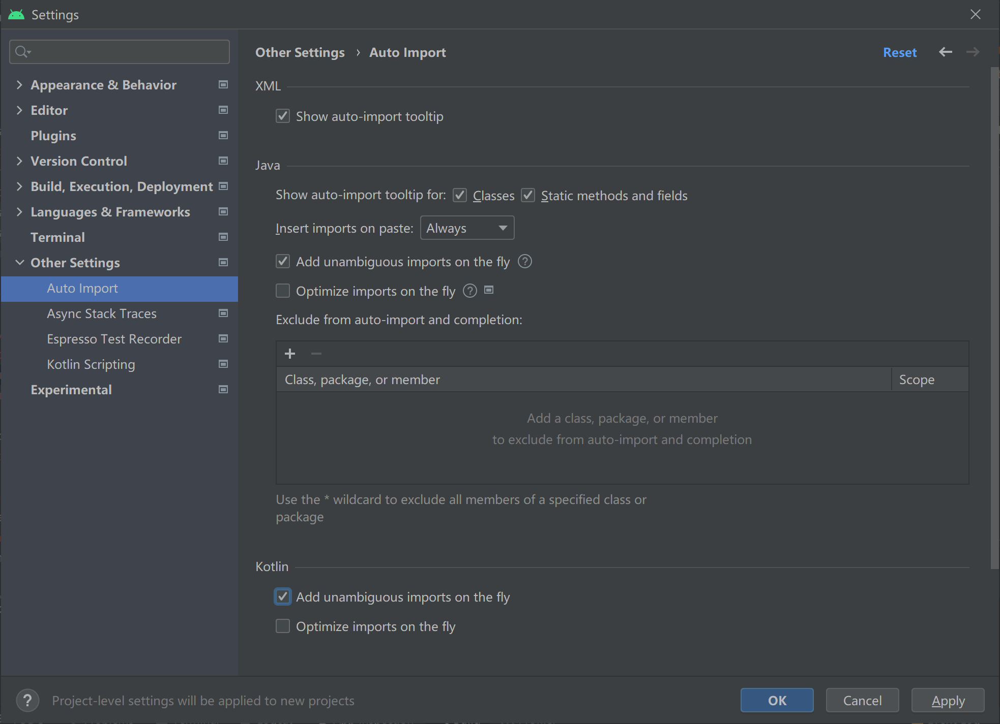

# Lab2
#### 2.1实现第一个Kotlin应用

###### 步骤

1、File -> New -> New Project -> Basic Activity -> 选择Kotlin -> 命名lab21 -> Finish

2、初始运行一下观察是否有错


3、修改字符串属性值和内容


4、运行一下观察结果


5、添加两个按钮，修改其id和布局，修改next按钮的id，注意，这里修改了next按钮的id在firstfragment.kt里的点击事件的名字也要修改，不然会运行出错，运行截图如下


##### 修改后的fragment_first.xml代码如下

```
<?xml version="1.0" encoding="utf-8"?>
<androidx.constraintlayout.widget.ConstraintLayout xmlns:android="http://schemas.android.com/apk/res/android"
    xmlns:app="http://schemas.android.com/apk/res-auto"
    xmlns:tools="http://schemas.android.com/tools"
    android:layout_width="match_parent"
    android:layout_height="match_parent"
    tools:context=".FirstFragment">

    <TextView
        android:id="@+id/textview_first"
        android:layout_width="wrap_content"
        android:layout_height="wrap_content"
        android:fontFamily="sans-serif-condensed"
        android:text="@string/hello_first_fragment"
        android:textColor="@android:color/darker_gray"
        android:textSize="30sp"
        android:textStyle="bold"
        app:layout_constraintBottom_toBottomOf="parent"
        app:layout_constraintEnd_toEndOf="parent"
        app:layout_constraintStart_toStartOf="parent"
        app:layout_constraintTop_toTopOf="parent" />

    <Button
        android:id="@+id/random_button"
        android:layout_width="wrap_content"
        android:layout_height="wrap_content"
        android:text="@string/random_button_text"
        app:layout_constraintBottom_toBottomOf="parent"
        app:layout_constraintEnd_toEndOf="parent"
        app:layout_constraintTop_toBottomOf="@+id/textview_first" />

    <Button
        android:id="@+id/toast_button"
        android:layout_width="wrap_content"
        android:layout_height="wrap_content"
        android:text="@string/toast_button_text"
        app:layout_constraintBottom_toBottomOf="parent"
        app:layout_constraintStart_toStartOf="parent"
        app:layout_constraintTop_toBottomOf="@+id/textview_first" />

    <Button
        android:id="@+id/count_button"
        android:layout_width="wrap_content"
        android:layout_height="wrap_content"
        android:text="@string/count_button_text"
        app:layout_constraintBottom_toBottomOf="parent"
        app:layout_constraintEnd_toStartOf="@+id/random_button"
        app:layout_constraintStart_toEndOf="@+id/toast_button"
        app:layout_constraintTop_toBottomOf="@+id/textview_first" />
</androidx.constraintlayout.widget.ConstraintLayout>

```

6、在color.xml里定义两个背景颜色

```
<color name="screenBackground">#2196F3</color>
<color name="buttonBackground">#BBDEFB</color>

```

6.1、fragment_first.xml的属性面板中设置屏幕背景色为

```
android:background="@color/screenBackground"

```

6.2、设置每个按钮的背景色为buttonBackground

```
android:background="@color/buttonBackground"

```

6.3、修改res/values/themes.xml的style值，添加**.Bridge**

```
<style name="Theme.MyFirstApp" parent="Theme.MaterialComponents.DayNight.DarkActionBar.Bridge">

```

6.4、移除TextView的背景颜色，设置TextView的文本颜色为color/white，并增大字体大小至72sp

7、设置组件的位置


8、运行一下观察结果


9、设置代码自动补全



10、为TOAST按钮添加一个toast消息

10.1、先修改next为randomButton

```
binding.randomButton.setOnClickListener {
    findNavController().navigate(R.id.action_FirstFragment_to_SecondFragment)
}

```

10.2、为TOAST按钮添加事件，使用**findViewById()**查找按钮id

```
// find the toast_button by its ID and set a click listener
view.findViewById<Button>(R.id.toast_button).setOnClickListener {
   // create a Toast with some text, to appear for a short time
   val myToast = Toast.makeText(context, "Hello Toast!", Toast.LENGTH_LONG)
   // show the Toast
   myToast.show()
}
```

11、使Count按钮更新屏幕的数字

11.1、在FirstFragment.kt文件，为count_buttion按钮添加事件：

```
view.findViewById<Button>(R.id.count_button).setOnClickListener {
   countMe(view)
}
```

11.2、countMe()为自定义方法，以View为参数，每次点击增加数字1

```
private fun countMe(view: View) {
   // Get the text view
   val showCountTextView = view.findViewById<TextView>(R.id.textview_first)

   // Get the value of the text view.
   val countString = showCountTextView.text.toString()

   // Convert value to a number and increment it
   var count = countString.toInt()
   count++

   // Display the new value in the text view.
   showCountTextView.text = count.toString()
}
```

12、新增一个textview，按照教程设置相应的约束和id和值，代码如下

```
<TextView
   android:id="@+id/textview_random"
   android:layout_width="wrap_content"
   android:layout_height="wrap_content"
   android:text="R"
   android:textColor="@android:color/white"
   android:textSize="72sp"
   android:textStyle="bold"
   app:layout_constraintBottom_toTopOf="@+id/button_second"
   app:layout_constraintEnd_toEndOf="parent"
   app:layout_constraintStart_toStartOf="parent"
   app:layout_constraintTop_toBottomOf="@+id/textview_second"
   app:layout_constraintVertical_bias="0.45" />
```

13、更新显示界面文本的TextView(textview_second)，代码如下

```
<TextView
   android:id="@+id/textview_header"
   android:layout_width="0dp"
   android:layout_height="wrap_content"
   android:layout_marginStart="24dp"
   android:layout_marginLeft="24dp"
   android:layout_marginTop="24dp"
   android:layout_marginEnd="24dp"
   android:layout_marginRight="24dp"
   android:text="@string/random_heading"
   android:textColor="@color/colorPrimaryDark"
   android:textSize="24sp"
   app:layout_constraintEnd_toEndOf="parent"
   app:layout_constraintStart_toStartOf="parent"
   app:layout_constraintTop_toTopOf="parent" />
```

14、检查导航图，截图如下


15、启用SafeArgs

Gradle的Project部分，在plugins节添加

```
id 'androidx.navigation.safeargs.kotlin' version '2.5.0-alpha01' apply false
```

module部分在plugins节添加

```
id 'androidx.navigation.safeargs'
```

16、创建导航动作的参数

16.1、打开导航视图，点击FirstFragment，查看其属性。

16.2、在Actions栏中可以看到导航至SecondFragment

16.3、同理，查看SecondFragment的属性栏

16.4、点击Arguments **+**符号

16.5、弹出的对话框中，添加参数myArg，类型为整型Integer


17、FirstFragment添加代码，向SecondFragment发数据

17.1、打开FirstFragment.kt源代码文件

17.2、找到onViewCreated()方法，该方法在onCreateView方法之后被调用，可以实现组件的初始化。找到Random按钮的响应代码，注释掉原先的事件处理代码

17.3、实例化TextView，获取TextView中文本并转换为整数值

```
val showCountTextView = view.findViewById<TextView>(R.id.textview_first)
val currentCount = showCountTextView.text.toString().toInt()
```

18、添加SecondFragment的代码

18.1、导入navArgs包

```
import androidx.navigation.fragment.navArgs
```

18.2、onViewCreated()代码之前添加一行

```
val args: SecondFragmentArgs by navArgs()
```

18.3、onViewCreated()中获取传递过来的参数列表，提取count数值，并在textview_header中显示

```
val count = args.myArg
val countText = getString(R.string.random_heading, count)
view.findViewById<TextView>(R.id.textview_header).text = countText
```

18.4、根据count值生成随机数

```
val random = java.util.Random()
var randomNumber = 0
if (count > 0) {
   randomNumber = random.nextInt(count + 1)
}
```

18.5、textview_random中显示count值

```
view.findViewById<TextView>(R.id.textview_random).text = randomNumber.toString()
```

19、运行一下，截图如下


