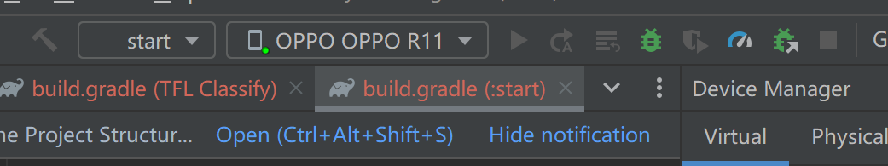
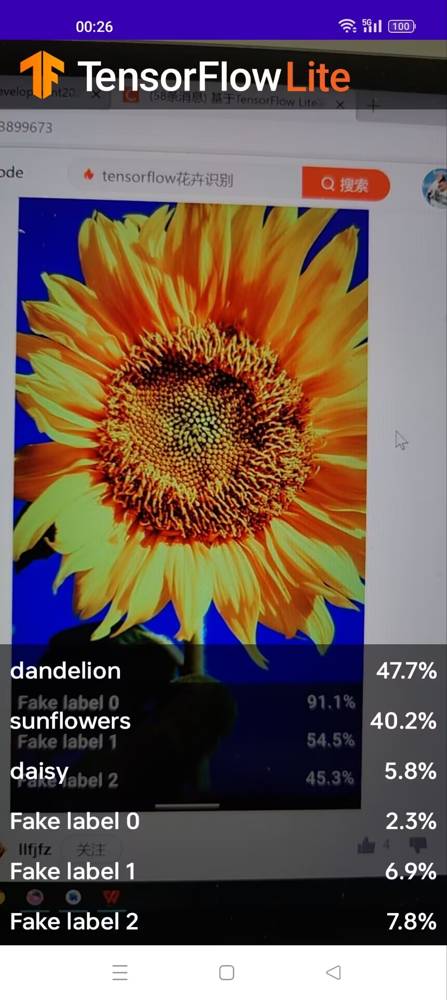
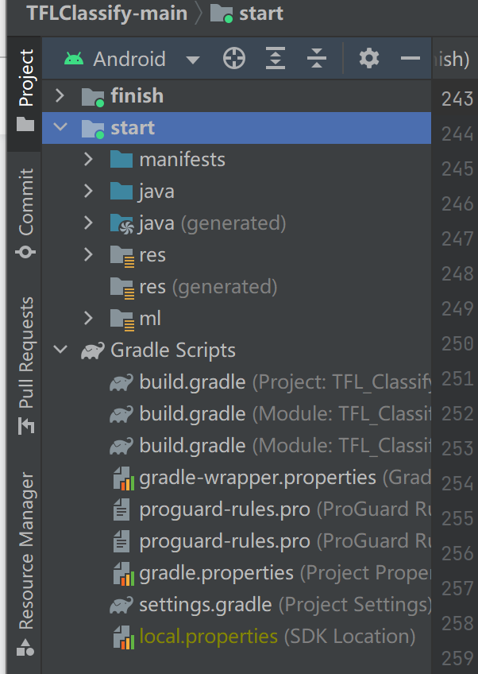
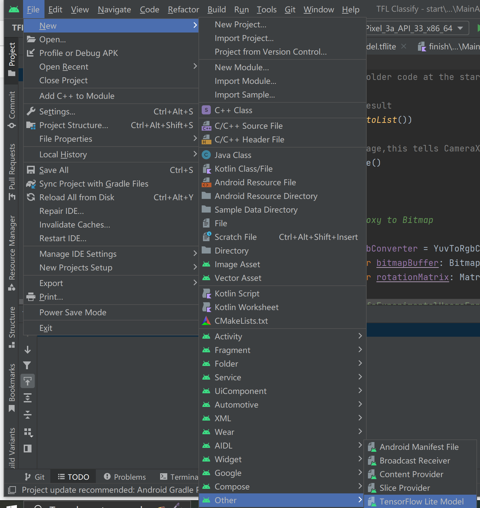
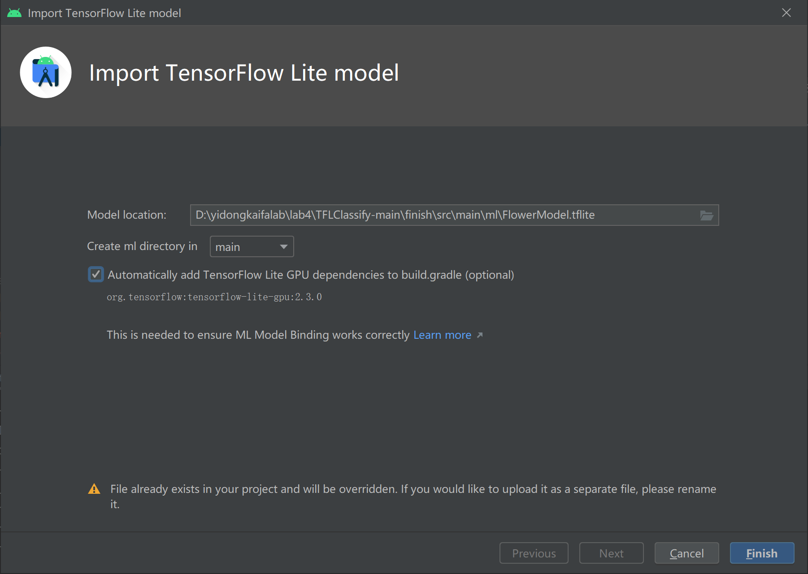
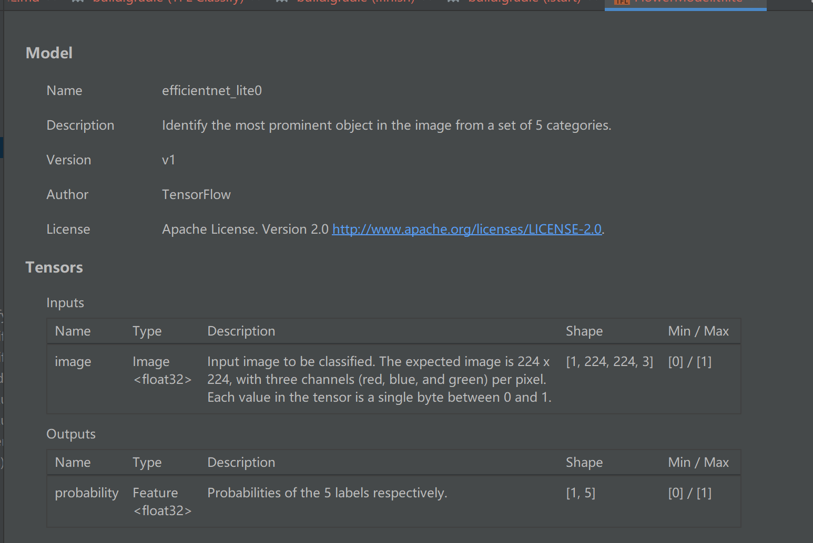

# Lab4
#### 基于TensorFlow Lite实现的Android花卉识别应用

###### 步骤

1、打开项目编译

2、手机通过USB接口连接开发平台，并设置手机开发者选项允许调试

3、选择真实物理机（而不是模拟器）运行start模块



4、允许应用获取手机摄像头的权限，得到下述效果图，界面利用随机数表示虚拟的识别结果



5、向应用中添加TensorFlow Lite

5.1、选择"start"模块



5.2、右键“start”模块，或者选择File，然后New>Other>TensorFlow Lite Model



5.3、选择已经下载的自定义的训练模型。本教程模型训练任务以后完成，这里选择finish模块中ml文件下的FlowerModel.tflite



5.4、最终TensorFlow Lite模型被成功导入，并生成摘要信息



6、添加代码重新运行APP

6.1、定位“start”模块MainActivity.kt文件的TODO 1，添加初始化训练模型的代码

```
private class ImageAnalyzer(ctx: Context, private val listener: RecognitionListener) :
        ImageAnalysis.Analyzer {

  ...
  // TODO 1: Add class variable TensorFlow Lite Model
  private val flowerModel = FlowerModel.newInstance(ctx)

  ...
}
```

6.2、在CameraX的analyze方法内部，需要将摄像头的输入ImageProxy转化为Bitmap对象，并进一步转化为TensorImage 对象

```
override fun analyze(imageProxy: ImageProxy) {
  ...
  // TODO 2: Convert Image to Bitmap then to TensorImage
  val tfImage = TensorImage.fromBitmap(toBitmap(imageProxy))
  ...
}
```

6.3、对图像进行处理并生成结果，主要包含下述操作：
6.3.1、按照属性score对识别结果按照概率从高到低排序
6.3.2、列出最高k种可能的结果，k的结果由常量MAX_RESULT_DISPLAY定义

```
override fun analyze(imageProxy: ImageProxy) {
  ...
  // TODO 3: Process the image using the trained model, sort and pick out the top results
  val outputs = flowerModel.process(tfImage)
      .probabilityAsCategoryList.apply {
          sortByDescending { it.score } // Sort with highest confidence first
      }.take(MAX_RESULT_DISPLAY) // take the top results

  ...
}
```

6.4、将识别的结果加入数据对象Recognition 中，包含label和score两个元素。后续将用于RecyclerView的数据显示

```
override fun analyze(imageProxy: ImageProxy) {
  ...
  // TODO 4: Converting the top probability items into a list of recognitions
  for (output in outputs) {
      items.add(Recognition(output.label, output.score))
  }
  ...
}
```

6.5、将原先用于虚拟显示识别结果的代码注释掉或者删除

```
// START - Placeholder code at the start of the codelab. Comment this block of code out.
for (i in 0..MAX_RESULT_DISPLAY-1){
    items.add(Recognition("Fake label $i", Random.nextFloat()))
}
// END - Placeholder code at the start of the codelab. Comment this block of code out.
```

6.6、以物理设备重新运行start模块


