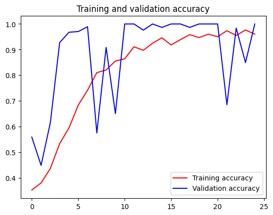

# TensorFlow Lite 模型生成

```python
import os

import numpy as np

import tensorflow as tf
assert tf.__version__.startswith('2')

from tflite_model_maker import model_spec
from tflite_model_maker import image_classifier
from tflite_model_maker.config import ExportFormat
from tflite_model_maker.config import QuantizationConfig
from tflite_model_maker.image_classifier import DataLoader

import matplotlib.pyplot as plt


```


```python
image_path = tf.keras.utils.get_file(
      'flower_photos.tgz',
      'https://storage.googleapis.com/download.tensorflow.org/example_images/flower_photos.tgz',
      extract=True)
image_path = os.path.join(os.path.dirname(image_path), 'flower_photos')

```


```python
data = DataLoader.from_folder(image_path)
train_data, test_data = data.split(0.9)

```

    INFO:tensorflow:Load image with size: 3670, num_label: 5, labels: daisy, dandelion, roses, sunflowers, tulips.
    

    INFO:tensorflow:Load image with size: 3670, num_label: 5, labels: daisy, dandelion, roses, sunflowers, tulips.
    


```python
model = image_classifier.create(train_data)

```

    INFO:tensorflow:Retraining the models...
    

    INFO:tensorflow:Retraining the models...
    

    Model: "sequential_1"
    _________________________________________________________________
     Layer (type)                Output Shape              Param #   
    =================================================================
     hub_keras_layer_v1v2_1 (Hub  (None, 1280)             3413024   
     KerasLayerV1V2)                                                 
                                                                     
     dropout_1 (Dropout)         (None, 1280)              0         
                                                                     
     dense_1 (Dense)             (None, 5)                 6405      
                                                                     
    =================================================================
    Total params: 3,419,429
    Trainable params: 6,405
    Non-trainable params: 3,413,024
    _________________________________________________________________
    None
    Epoch 1/5
    103/103 [==============================] - 53s 496ms/step - loss: 0.8643 - accuracy: 0.7709
    Epoch 2/5
    103/103 [==============================] - 51s 493ms/step - loss: 0.6500 - accuracy: 0.8962
    Epoch 3/5
    103/103 [==============================] - 50s 487ms/step - loss: 0.6196 - accuracy: 0.9138
    Epoch 4/5
    103/103 [==============================] - 50s 488ms/step - loss: 0.6015 - accuracy: 0.9275
    Epoch 5/5
    103/103 [==============================] - 50s 488ms/step - loss: 0.5896 - accuracy: 0.9336
    


```python
loss, accuracy = model.evaluate(test_data)

```

    12/12 [==============================] - 8s 463ms/step - loss: 0.6284 - accuracy: 0.9101
    


```python
model.export(export_dir='.')

```

    INFO:tensorflow:Assets written to: /tmp/tmppy3j9ku5/assets
    

    INFO:tensorflow:Assets written to: /tmp/tmppy3j9ku5/assets
    2023-06-06 13:10:26.515392: I tensorflow/core/grappler/devices.cc:66] Number of eligible GPUs (core count >= 8, compute capability >= 0.0): 0
    2023-06-06 13:10:26.515554: I tensorflow/core/grappler/clusters/single_machine.cc:358] Starting new session
    2023-06-06 13:10:26.557375: I tensorflow/core/grappler/optimizers/meta_optimizer.cc:1164] Optimization results for grappler item: graph_to_optimize
      function_optimizer: Graph size after: 913 nodes (656), 923 edges (664), time = 23.629ms.
      function_optimizer: function_optimizer did nothing. time = 0.008ms.
    
    /opt/conda/envs/tf/lib/python3.8/site-packages/tensorflow/lite/python/convert.py:746: UserWarning: Statistics for quantized inputs were expected, but not specified; continuing anyway.
      warnings.warn("Statistics for quantized inputs were expected, but not "
    2023-06-06 13:10:27.349956: W tensorflow/compiler/mlir/lite/python/tf_tfl_flatbuffer_helpers.cc:357] Ignored output_format.
    2023-06-06 13:10:27.350001: W tensorflow/compiler/mlir/lite/python/tf_tfl_flatbuffer_helpers.cc:360] Ignored drop_control_dependency.
    

    INFO:tensorflow:Label file is inside the TFLite model with metadata.
    

    fully_quantize: 0, inference_type: 6, input_inference_type: 3, output_inference_type: 3
    INFO:tensorflow:Label file is inside the TFLite model with metadata.
    

    INFO:tensorflow:Saving labels in /tmp/tmpbd8_9os0/labels.txt
    

    INFO:tensorflow:Saving labels in /tmp/tmpbd8_9os0/labels.txt
    

    INFO:tensorflow:TensorFlow Lite model exported successfully: ./model.tflite
    

    INFO:tensorflow:TensorFlow Lite model exported successfully: ./model.tflite
    


# TensorFlow训练石头剪刀布数据集

```python
rock_dir = os.path.join('E:/rps/rock')
paper_dir = os.path.join('E:/rps/paper')
scissors_dir = os.path.join('E:/rps/scissors')

print('total training rock images:', len(os.listdir(rock_dir)))
print('total training paper images:', len(os.listdir(paper_dir)))
print('total training scissors images:', len(os.listdir(scissors_dir)))

rock_files = os.listdir(rock_dir)
print(rock_files[:10])

paper_files = os.listdir(paper_dir)
print(paper_files[:10])

scissors_files = os.listdir(scissors_dir)
print(scissors_files[:10])

```


    ---------------------------------------------------------------------------

    NameError                                 Traceback (most recent call last)

    ~\AppData\Local\Temp\ipykernel_21876\3501040782.py in <module>
    ----> 1 rock_dir = os.path.join('E:/rps/rock')
          2 paper_dir = os.path.join('E:/rps/paper')
          3 scissors_dir = os.path.join('E:/rps/scissors')
          4 
          5 print('total training rock images:', len(os.listdir(rock_dir)))
    

    NameError: name 'os' is not defined


```python
import os
```


```python
rock_dir = os.path.join('E:/rps/rock')
paper_dir = os.path.join('E:/rps/paper')
scissors_dir = os.path.join('E:/rps/scissors')

print('total training rock images:', len(os.listdir(rock_dir)))
print('total training paper images:', len(os.listdir(paper_dir)))
print('total training scissors images:', len(os.listdir(scissors_dir)))

rock_files = os.listdir(rock_dir)
print(rock_files[:10])

paper_files = os.listdir(paper_dir)
print(paper_files[:10])

scissors_files = os.listdir(scissors_dir)
print(scissors_files[:10])
```

    total training rock images: 840
    total training paper images: 840
    total training scissors images: 840
    ['rock01-000.png', 'rock01-001.png', 'rock01-002.png', 'rock01-003.png', 'rock01-004.png', 'rock01-005.png', 'rock01-006.png', 'rock01-007.png', 'rock01-008.png', 'rock01-009.png']
    ['paper01-000.png', 'paper01-001.png', 'paper01-002.png', 'paper01-003.png', 'paper01-004.png', 'paper01-005.png', 'paper01-006.png', 'paper01-007.png', 'paper01-008.png', 'paper01-009.png']
    ['scissors01-000.png', 'scissors01-001.png', 'scissors01-002.png', 'scissors01-003.png', 'scissors01-004.png', 'scissors01-005.png', 'scissors01-006.png', 'scissors01-007.png', 'scissors01-008.png', 'scissors01-009.png']
    


```python
%matplotlib inline

import matplotlib.pyplot as plt
import matplotlib.image as mpimg

pic_index = 2

next_rock = [os.path.join(rock_dir, fname) 
                for fname in rock_files[pic_index-2:pic_index]]
next_paper = [os.path.join(paper_dir, fname) 
                for fname in paper_files[pic_index-2:pic_index]]
next_scissors = [os.path.join(scissors_dir, fname) 
                for fname in scissors_files[pic_index-2:pic_index]]

for i, img_path in enumerate(next_rock+next_paper+next_scissors):
  #print(img_path)
  img = mpimg.imread(img_path)
  plt.imshow(img)
  plt.axis('Off')
  plt.show()
```


    

    


    

    


    

    


    

    


    

    


    

    


```python
import tensorflow as tf
import keras_preprocessing
from keras_preprocessing import image
from keras_preprocessing.image import ImageDataGenerator

TRAINING_DIR = "E:/rps/"
training_datagen = ImageDataGenerator(
      rescale = 1./255,
	    rotation_range=40,
      width_shift_range=0.2,
      height_shift_range=0.2,
      shear_range=0.2,
      zoom_range=0.2,
      horizontal_flip=True,
      fill_mode='nearest')

VALIDATION_DIR = "E:/rps-test-set/"
validation_datagen = ImageDataGenerator(rescale = 1./255)

train_generator = training_datagen.flow_from_directory(
	TRAINING_DIR,
	target_size=(150,150),
	class_mode='categorical',
  batch_size=126
)

validation_generator = validation_datagen.flow_from_directory(
	VALIDATION_DIR,
	target_size=(150,150),
	class_mode='categorical',
  batch_size=126
)

model = tf.keras.models.Sequential([
    # Note the input shape is the desired size of the image 150x150 with 3 bytes color
    # This is the first convolution
    tf.keras.layers.Conv2D(64, (3,3), activation='relu', input_shape=(150, 150, 3)),
    tf.keras.layers.MaxPooling2D(2, 2),
    # The second convolution
    tf.keras.layers.Conv2D(64, (3,3), activation='relu'),
    tf.keras.layers.MaxPooling2D(2,2),
    # The third convolution
    tf.keras.layers.Conv2D(128, (3,3), activation='relu'),
    tf.keras.layers.MaxPooling2D(2,2),
    # The fourth convolution
    tf.keras.layers.Conv2D(128, (3,3), activation='relu'),
    tf.keras.layers.MaxPooling2D(2,2),
    # Flatten the results to feed into a DNN
    tf.keras.layers.Flatten(),
    tf.keras.layers.Dropout(0.5),
    # 512 neuron hidden layer
    tf.keras.layers.Dense(512, activation='relu'),
    tf.keras.layers.Dense(3, activation='softmax')
])


model.summary()

model.compile(loss = 'categorical_crossentropy', optimizer='rmsprop', metrics=['accuracy'])

history = model.fit(train_generator, epochs=25, steps_per_epoch=20, validation_data = validation_generator, verbose = 1, validation_steps=3)

model.save("rps.h5")

```

    Found 2520 images belonging to 3 classes.
    Found 372 images belonging to 3 classes.
    Model: "sequential"
    _________________________________________________________________
     Layer (type)                Output Shape              Param #   
    =================================================================
     conv2d (Conv2D)             (None, 148, 148, 64)      1792      
                                                                     
     max_pooling2d (MaxPooling2D  (None, 74, 74, 64)       0         
     )                                                               
                                                                     
     conv2d_1 (Conv2D)           (None, 72, 72, 64)        36928     
                                                                     
     max_pooling2d_1 (MaxPooling  (None, 36, 36, 64)       0         
     2D)                                                             
                                                                     
     conv2d_2 (Conv2D)           (None, 34, 34, 128)       73856     
                                                                     
     max_pooling2d_2 (MaxPooling  (None, 17, 17, 128)      0         
     2D)                                                             
                                                                     
     conv2d_3 (Conv2D)           (None, 15, 15, 128)       147584    
                                                                     
     max_pooling2d_3 (MaxPooling  (None, 7, 7, 128)        0         
     2D)                                                             
                                                                     
     flatten (Flatten)           (None, 6272)              0         
                                                                     
     dropout (Dropout)           (None, 6272)              0         
                                                                     
     dense (Dense)               (None, 512)               3211776   
                                                                     
     dense_1 (Dense)             (None, 3)                 1539      
                                                                     
    =================================================================
    Total params: 3,473,475
    Trainable params: 3,473,475
    Non-trainable params: 0
    _________________________________________________________________
    Epoch 1/25
    20/20 [==============================] - 71s 3s/step - loss: 1.5301 - accuracy: 0.3528 - val_loss: 1.0804 - val_accuracy: 0.5591
    Epoch 2/25
    20/20 [==============================] - 55s 3s/step - loss: 1.1064 - accuracy: 0.3806 - val_loss: 1.0441 - val_accuracy: 0.4489
    Epoch 3/25
    20/20 [==============================] - 55s 3s/step - loss: 1.0564 - accuracy: 0.4369 - val_loss: 1.0172 - val_accuracy: 0.6156
    Epoch 4/25
    20/20 [==============================] - 52s 3s/step - loss: 0.9758 - accuracy: 0.5337 - val_loss: 0.4690 - val_accuracy: 0.9274
    Epoch 5/25
    20/20 [==============================] - 52s 3s/step - loss: 0.8852 - accuracy: 0.5944 - val_loss: 0.4394 - val_accuracy: 0.9677
    Epoch 6/25
    20/20 [==============================] - 52s 3s/step - loss: 0.7505 - accuracy: 0.6837 - val_loss: 0.3743 - val_accuracy: 0.9704
    Epoch 7/25
    20/20 [==============================] - 52s 3s/step - loss: 0.6166 - accuracy: 0.7417 - val_loss: 0.1690 - val_accuracy: 0.9892
    Epoch 8/25
    20/20 [==============================] - 52s 3s/step - loss: 0.4390 - accuracy: 0.8103 - val_loss: 0.7863 - val_accuracy: 0.5753
    Epoch 9/25
    20/20 [==============================] - 54s 3s/step - loss: 0.4348 - accuracy: 0.8206 - val_loss: 0.1611 - val_accuracy: 0.9086
    Epoch 10/25
    20/20 [==============================] - 54s 3s/step - loss: 0.3974 - accuracy: 0.8556 - val_loss: 0.8179 - val_accuracy: 0.6505
    Epoch 11/25
    20/20 [==============================] - 54s 3s/step - loss: 0.3748 - accuracy: 0.8643 - val_loss: 0.0898 - val_accuracy: 1.0000
    Epoch 12/25
    20/20 [==============================] - 54s 3s/step - loss: 0.2363 - accuracy: 0.9111 - val_loss: 0.0355 - val_accuracy: 1.0000
    Epoch 13/25
    20/20 [==============================] - 55s 3s/step - loss: 0.2691 - accuracy: 0.8972 - val_loss: 0.1301 - val_accuracy: 0.9758
    Epoch 14/25
    20/20 [==============================] - 54s 3s/step - loss: 0.2087 - accuracy: 0.9250 - val_loss: 0.0266 - val_accuracy: 1.0000
    Epoch 15/25
    20/20 [==============================] - 54s 3s/step - loss: 0.1600 - accuracy: 0.9460 - val_loss: 0.0280 - val_accuracy: 0.9866
    Epoch 16/25
    20/20 [==============================] - 54s 3s/step - loss: 0.2039 - accuracy: 0.9183 - val_loss: 0.0132 - val_accuracy: 1.0000
    Epoch 17/25
    20/20 [==============================] - 55s 3s/step - loss: 0.1730 - accuracy: 0.9389 - val_loss: 0.0308 - val_accuracy: 1.0000
    Epoch 18/25
    20/20 [==============================] - 56s 3s/step - loss: 0.1097 - accuracy: 0.9583 - val_loss: 0.0418 - val_accuracy: 0.9866
    Epoch 19/25
    20/20 [==============================] - 57s 3s/step - loss: 0.1439 - accuracy: 0.9468 - val_loss: 0.0125 - val_accuracy: 1.0000
    Epoch 20/25
    20/20 [==============================] - 56s 3s/step - loss: 0.1094 - accuracy: 0.9603 - val_loss: 0.0097 - val_accuracy: 1.0000
    Epoch 21/25
    20/20 [==============================] - 56s 3s/step - loss: 0.1368 - accuracy: 0.9504 - val_loss: 0.0146 - val_accuracy: 1.0000
    Epoch 22/25
    20/20 [==============================] - 56s 3s/step - loss: 0.0805 - accuracy: 0.9738 - val_loss: 1.5486 - val_accuracy: 0.6855
    Epoch 23/25
    20/20 [==============================] - 56s 3s/step - loss: 0.1434 - accuracy: 0.9552 - val_loss: 0.0479 - val_accuracy: 0.9839
    Epoch 24/25
    20/20 [==============================] - 60s 3s/step - loss: 0.0751 - accuracy: 0.9766 - val_loss: 0.3478 - val_accuracy: 0.8495
    Epoch 25/25
    20/20 [==============================] - 58s 3s/step - loss: 0.1172 - accuracy: 0.9603 - val_loss: 0.0227 - val_accuracy: 1.0000
    


```python
import matplotlib.pyplot as plt
acc = history.history['accuracy']
val_acc = history.history['val_accuracy']
loss = history.history['loss']
val_loss = history.history['val_loss']

epochs = range(len(acc))

plt.plot(epochs, acc, 'r', label='Training accuracy')
plt.plot(epochs, val_acc, 'b', label='Validation accuracy')
plt.title('Training and validation accuracy')
plt.legend(loc=0)
plt.figure()
plt.show()
```


    

    


    <Figure size 640x480 with 0 Axes>


```python

```
